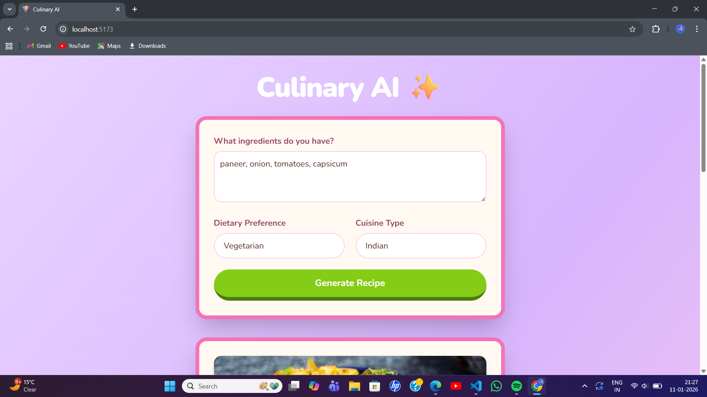
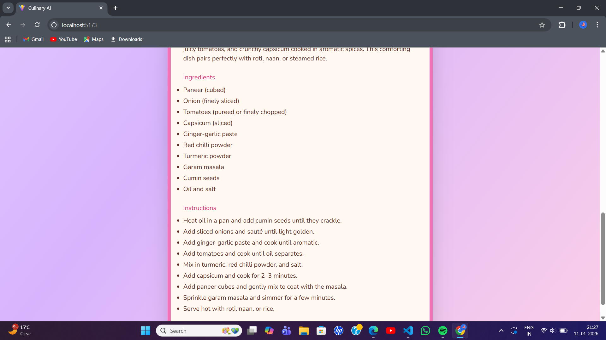
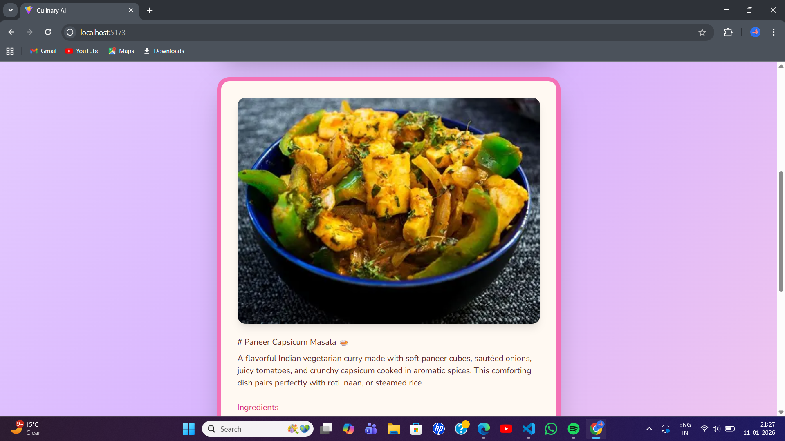

# Recipe AI – Intelligent Recipe Generator

Recipe AI is a full-stack web application that generates creative vegetarian recipes based on user-provided ingredients, dietary preferences, and cuisine type. The project focuses on clean UI design, modular backend architecture, and AI-ready integration.

---

## Features

-  Generate recipes using custom ingredients
-  Supports dietary preferences (e.g., Vegetarian)
-  Cuisine-specific recipe generation (e.g., Indian)
-  Well-formatted recipe output including:
    - Title
    - Short description
    - Ingredients list
    - Step-by-step instructions
-  Responsive and visually appealing user interface
-  Backend structured for AI integration

---

## Tech Stack

### Frontend
- React.js
- Tailwind CSS
- JavaScript (ES6+)

### Backend
- Node.js
- Express.js
- RESTful APIs

---

## Screenshots

### Home Screen

### Generated Recipe

### Generated Image

---
## AI Integration Status

- The AI response is currently mocked for demonstration purposes due to API quota limitations.
- The backend is fully structured to support AI-generated content.
- Mock data is used to simulate realistic AI responses.
- The project can be seamlessly connected to a live AI model when API access is available.
